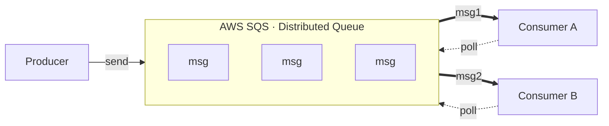

> Частина теми [[Messaging and Queuing]].

Сервіс, що надає захищену, надійну та доступну чергу, куда інші сервіси можуть надсилати messages (producer) або отримати (consumer) ті messages з неї. Кожен message призначний для обробки лише одним consumer. SQS зберігає ці messages на різних серверах (distributed), щоб забезпечити durability i availability.

Варто зазначити, що SQS не відповідає за переадресацію messages від producer до consumer. SQS має місце, куда всі ці messages потрапляють від producer, а вже самі consumers стукається в це місце (polling) і дивляться чи немає нічого для обробки. Таким чином ми не нагружаємо наших consumers цими messages і кожен з них при по требі сам заходить в цю чергу і бере message для обробки.

## Polling: short vs long

Consumer сам опитує чергу (pull-модель). SQS підтримує два режими, і який спрацює - залежить від параметра `WaitTimeSeconds`:

- **Short polling** (`WaitTimeSeconds = 0`, за замовчуванням) - запит повертається одразу. SQS опитує лише частину своїх серверів, тому може повернути порожню відповідь, навіть коли messages у черзі є. Більше "холостих" запитів -> більше витрат.
- **Long polling** (`WaitTimeSeconds > 0`, до 20 сек) - запит чекає, поки не з'явиться message або не вийде час. Опитує всі сервери, тому порожніх відповідей майже немає. Менше зайвих запитів, дешевше.

Налаштувати можна на рівні черги (атрибут `ReceiveMessageWaitTimeSeconds`) або на рівні окремого запиту (`WaitTimeSeconds` у `ReceiveMessage`, перекриває налаштування черги). AWS рекомендує в більшості випадків long polling.

## Message lifecycle (visibility timeout)

Кожен message в SQS проходить свій життєвий цикл від моменту, коли producer поклав його в чергу, до моменту, коли consumer його обробив і видалив. Ключова штука тут - **visibility timeout**, бо саме вона забезпечує те, що один і той самий message не обробляється двома consumers одночасно.

Розберемо по кроках:

1. **Producer надсилає message** в чергу. Message лежить у черзі і є видимим (visible), тобто будь-який consumer при опитуванні може його побачити і забрати.

2. **Consumer забирає message** (poll -> `ReceiveMessage`). В цей момент message не видаляється з черги, а стає **невидимим (invisible)** для всіх інших consumers на певний проміжок часу. Цей проміжок і називається **visibility timeout** (за замовчуванням 30 секунд). Тобто message нікуди не зникає, він просто ховається, щоб ніхто інший його паралельно не схопив і не почав обробляти вдруге.

3. Далі є два сценарії:
   - **Consumer встиг обробити message вчасно** - тоді він каже черзі `DeleteMessage`, і message видаляється з черги назавжди. На цьому його життя закінчується.
   - **Consumer не встиг (timeout вийшов) або взагалі впав** - тоді message автоматично знову стає видимим (visible), і його може забрати інший (або той самий) consumer. Так SQS гарантує, що message не загубиться, якщо consumer зламався на середині обробки.

Саме тому важливо правильно підбирати visibility timeout: якщо він **занадто малий**, message може стати видимим ще до того, як consumer закінчив обробку, і його схопить другий consumer (обробка вдвічі). Якщо **занадто великий** - у разі падіння consumer message довго висітиме невидимим і його повторна обробка затягнеться.